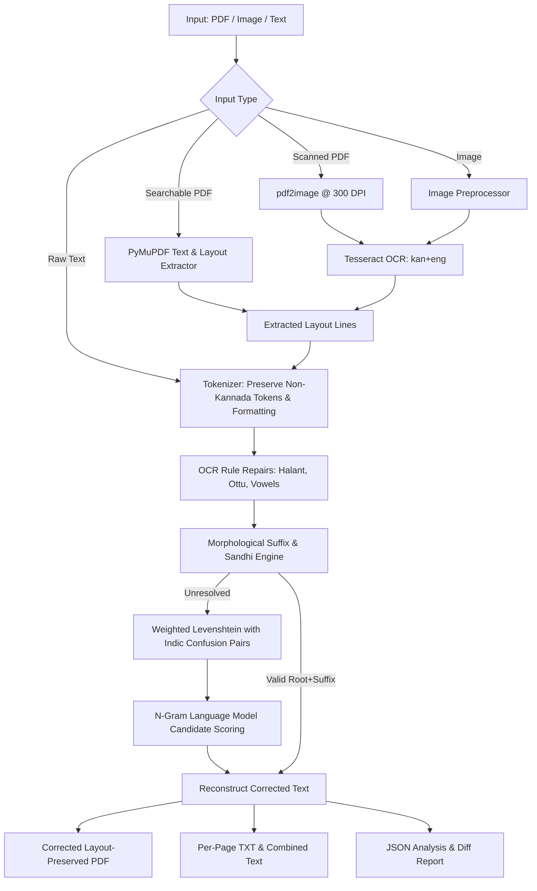

# GEMINI.md — Kannada OCR & Autocorrect Pipeline

Context, architecture reference, and development guidelines for the **Kannada OCR & Autocorrect Pipeline** repository.

---

## 1. Project Overview

This repository provides an end-to-end Indic document ingestion, OCR, and post-processing pipeline for the Kannada language (`kn_IN`). It integrates optical character recognition for scanned/searchable PDFs and images with rule-based Indic OCR repairs, morphological decomposition, weighted Levenshtein distance, N-gram ranking, and layout-preserving PDF export.

---

## 2. Directory Structure & Key Modules

```
kannada_ocr_pipeline/
├── pipeline/                   # Core pipeline library
│   ├── __init__.py             # process_document(), process_text_input(), init_pipeline()
│   ├── ingestion/              # Document loading & extraction
│   │   ├── pdf_processor.py    # PyMuPDF (digital text) + pdf2image (scanned rasterization)
│   │   └── image_processor.py  # Image loading, EXIF auto-rotation, contrast boost
│   ├── ocr/                    # Optical Character Recognition
│   │   └── tesseract_engine.py # Multi-language Indic Tesseract OCR + bounding box/layout analysis
│   ├── correction/             # Post-OCR cleaning & morphological autocorrect
│   │   ├── tokenizer.py        # Kannada (U+0C80-U+0CFF) vs. Non-Kannada token segmentation
│   │   ├── ocr_repairs.py      # Indic Virama/Halant repairs, ottu collapsing, vowel fixes
│   │   ├── morphology.py       # Agglutinative suffix stripping & Sandhi joining rules
│   │   ├── dictionary.py       # Hunspell kn_IN.dic + kn_IN.aff rule parser and indexer
│   │   ├── edit_distance.py    # Weighted Levenshtein with Indic glyph confusion matrix
│   │   ├── ngram.py            # Unigram/bigram language model candidate scoring
│   │   └── corrector.py        # Core corrector combining all correction stages
│   └── exporter/               # Output generation
│       ├── pdf_generator.py    # Layout-preserving PDF generator (FPDF2 + Noto Sans Kannada)
│       └── text_exporter.py    # Per-page .txt exporter & structured JSON report generator
├── web/                        # Flask Web Dashboard
│   ├── app.py                  # Web application & REST APIs
│   ├── static/
│   │   ├── css/style.css       # Responsive glassmorphic UI styles
│   │   ├── js/app.js           # Client logic (live autocorrect, upload dropzone, diff viewer)
│   │   └── fonts/              # NotoSansKannada-Regular.ttf
│   └── templates/index.html    # Dashboard HTML template
├── data/                       # Hunspell kn_IN.dic and kn_IN.aff
├── tests/                      # Automated unit & integration tests
│   └── test_pipeline.py        # Tokenizer, morphology, OCR repair, and exporter tests
├── cli.py                      # Command-Line Interface tool
├── setup.py                    # Asset downloader for dictionaries and fonts
├── requirements.txt            # Python dependencies
└── README.md                   # User guide & documentation
```

---

## 3. Core Processing Pipeline



---

## 4. Development & Environment Setup

### Prerequisites
- **macOS**: `brew install tesseract tesseract-lang poppler`
- **Ubuntu/Debian**: `sudo apt install tesseract-ocr tesseract-ocr-kan tesseract-ocr-eng poppler-utils`

### Python Environment
```bash
# Create and activate virtual environment
python3 -m venv venv
source venv/bin/activate

# Install dependencies
pip install -r requirements.txt

# Download / Verify dictionary and font assets
python setup.py
```

---

## 5. Verification & Testing

Always execute the test suite when making changes to the correction engine or exporter:

```bash
# Run unit & integration tests
./venv/bin/python tests/test_pipeline.py

# Test CLI text correction
./venv/bin/python cli.py --text "ಶಿಕ್ಷಣವು ಪ್ರತಿಯೊಬ್ಬ ವ್ಯಕ್ತಿಯ ಜಿವನದಲ್ಲಿ ಪ್ರಮುಖ ಪಾತ್ರ ವಹಿಸುತದೆ"

# Run Flask server in development mode
./venv/bin/python web/app.py
```

---

## 6. Key Guidelines & Design Rules

1. **Unicode & Token Preservation**:
   - Kannada characters fall in `[\u0C80-\u0CFF\u200C\u200D]`.
   - Never mutate non-Kannada tokens (English words, numbers, punctuation, markdown/HTML tags); preserve their exact byte offsets so `reconstruct(tokens)` maintains document integrity.

2. **Indic Morphology & Sandhi**:
   - Suffixes in `morphology.py` are sorted longest-first to prevent greedy partial matches.
   - When modifying suffix rules, ensure corresponding Sandhi join rules in `join_root_suffix()` are updated.

3. **Glyph Confusion Costs**:
   - Visually similar Kannada glyphs in `edit_distance.py` (e.g. `ಕ`/`ಖ`, `ಗ`/`ಘ`, `ತ`/`ಥ`, `ಪ`/`ಫ`) have custom substitution penalties (`0.3`–`0.5`) to outrank generic dictionary stems.

4. **PDF Font Integrity**:
   - PDFs generated by `pdf_generator.py` require Unicode TTF support (`NotoSansKannada-Regular.ttf`).
   - Line widths must use `pdf.epw` and proper cursor management with `new_x="LMARGIN", new_y="NEXT"`.

---

## 7. Strict Prohibition on Word-Specific Hardcoding (Zero-Hardcoding Rule)

> [!IMPORTANT]
> **NEVER add word-specific or stem-specific hardcoded rules to the codebase.**

1. **No Specific Word Mappings**:
   - Do NOT add specific Kannada words or custom stem-to-word transforms (e.g., `'ಧ್ಯಯ' -> 'ಧ್ಯಯನ'`, `'ಸಂಯುವ' -> 'ಸಾಯುವ'`, etc.) to `CONFUSION_PAIRS`, `GLYPH_CONFUSIONS`, or `ocr_repairs.py`.
   - Every correction must arise dynamically through universal principles:
     - **Universal Script Normalizations**: General Unicode/OCR glitch cleanup (e.g. illegal independent vowel + matra `ಎ[ಿೀ] -> ಅ`, Repha regex `...೯ -> ರ್...`, zero-to-anusvara conversion `೦ -> ಂ`).
     - **Optical Confusion Matrices**: Single-glyph and visual subscript ottu shape ambiguities (`ಕ/ಖ`, `ಶ/ತ`, `ಹ/ಯ`, `ಳ/ಕ`, `ಂಜ/ಂದ`, `ವ್ಮ/ಮ್ಮ`, `ಸ್ಮ/ಷ್ಮೆ`).
     - **Dynamic Morphological Decomposition**: Longest-match suffix stripping (`-ಗಳು`, `-ದಲ್ಲಿ`, `-ಅಂತಹವಳು`, `-ವಿತ್ತು`) and Sandhi euphonic rules.
     - **Universal 1-Edit Search**: Dynamic single-character insertion and deletion candidate generation against the Hunspell lexicon.
     - **Language Model Context Scoring**: N-gram unigram and bigram ranking.

2. **Vocabulary & Lexicon Rules**:
   - New root words belong in the Hunspell dictionary (`data/kn_IN.dic`), not as hardcoded conditional branches in the correction engine.
   - Any new test case or scan error must be resolved by refining universal glyph weights, morphological suffix rules, or generic 1-edit candidate generation.
